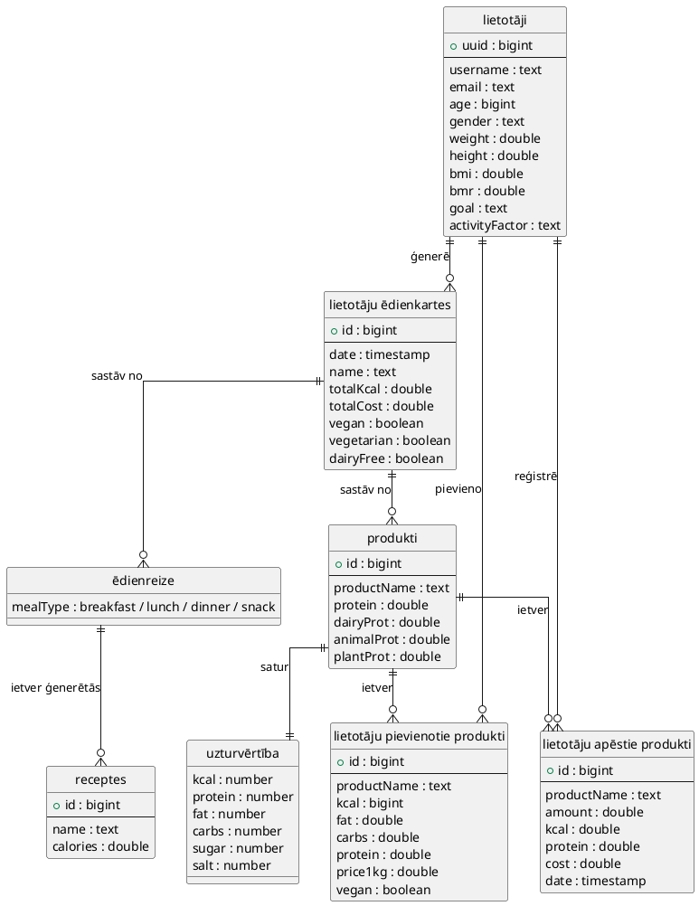
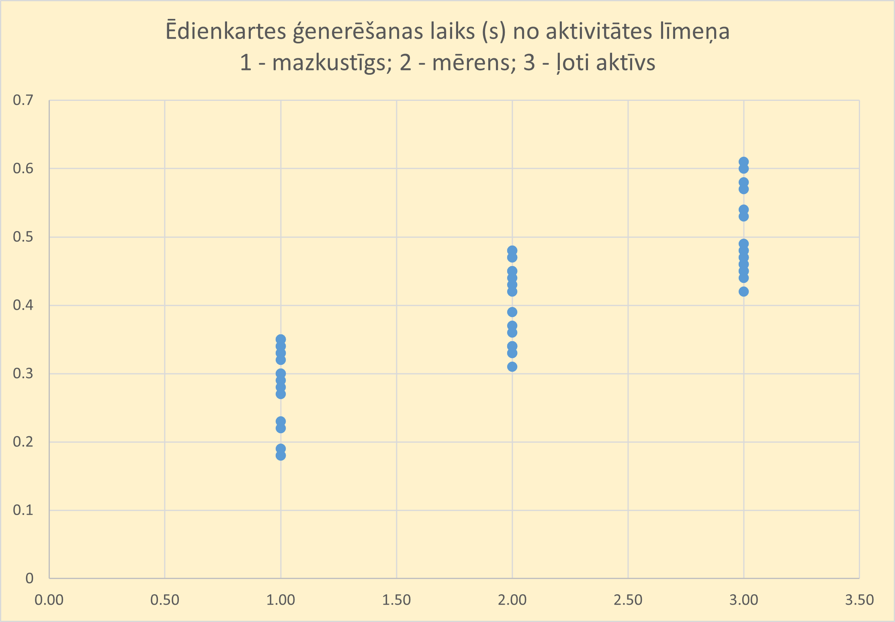
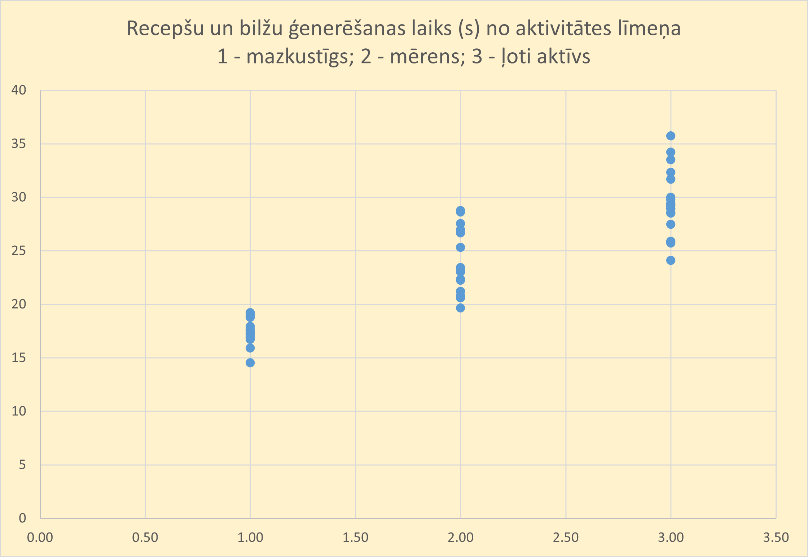
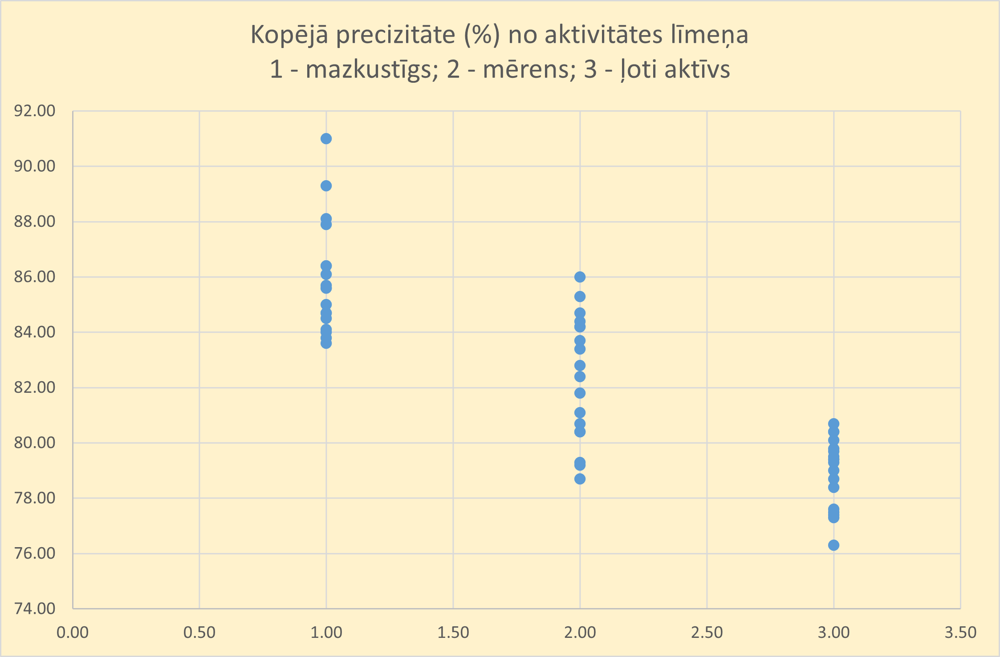
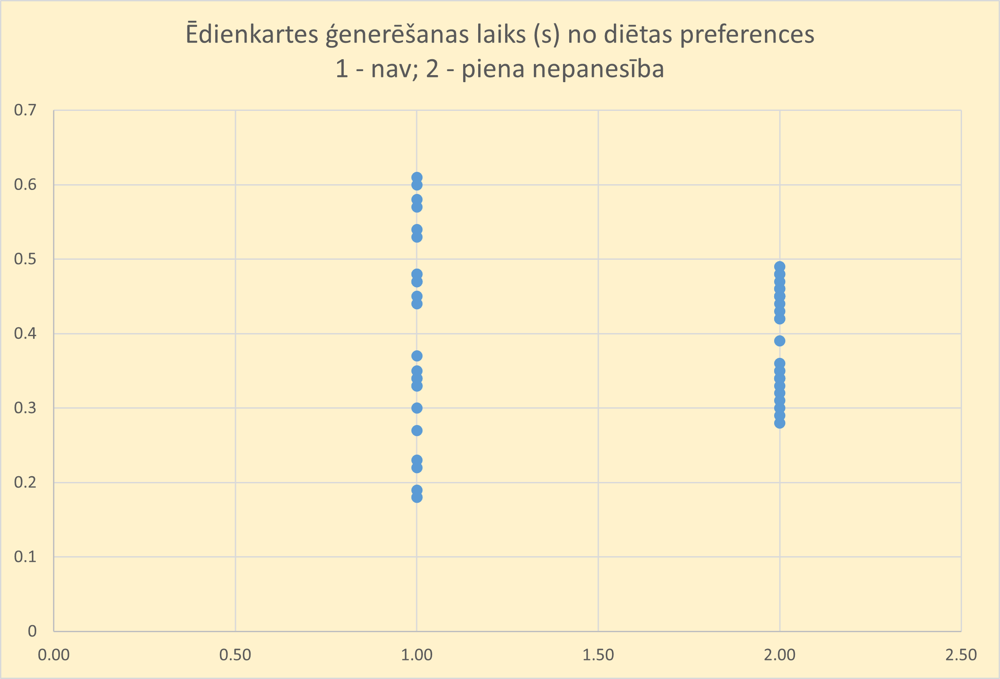
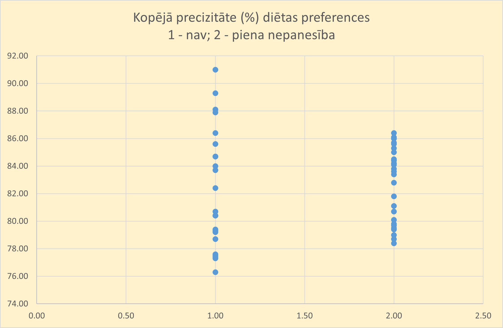

## Ievads

Diētas optimizācijas problēma ir viena no klasiskākajiem lineārās programmēšanas piemēriem, kas pirmo reizi formulēts 20\. Gadsimta vidū ar mērķi atrast lētako risinājumu uzturam, kas vienlaikus spētu nodrošināt cilvēkam nepieciešamo uzturvielu daudzumu. Sākotnējais uzdevums tika izstrādāts ASV armijas vajadzībām (https://pmc.ncbi.nlm.nih.gov/articles/PMC6021504/\#abstract1), taču vēlāk šis mdelis ieguva plašāku pielietojumu dažados uztura plānošanas un sabiedrības veselības kontekstos. Līdz ar tehnoloģiju attīstību un lineārās programmēšanas rīku pieejamību, diētas problēmas risināšana kļuvusi efektīvāka (https://www.nature.com/articles/ejcn201556).  
Šobrīd diētas optimizācijas problēma ir aktuāla ne tikai individuāla uztura sabalansēšanā, bet arī plašākā kontekstā, piemēram, pārtikas palīdzības atbalsta programmās, ilgstpējīgas pārtikas politikas izstrādē vai valsts uztura vadlīnijās. Pētījumi rāda, ka uztura modeļus bieži ir grūti izveidot tā, lai tie vienlaikus būtu gan uzturvērtīgi, gan izmaksu ziņā efektīvi, tāpēc lineārās programmēšanas pieejas kļūst par nozīmīgu instrumentu optimāliem risinājumiem. (https://www.slideshare.net/slideshow/the-diet-problem/32900458)

## Problēmas nostādne

Ikdienā cilvēkam nepieciešams uzturs, kas nodrošina visas organismam nepieciešamās uzturvielas, taču bieži šāda uztura nodrošināšanu ierobežo gan pārtikas pieejamība, gan pārtikas cenas, gan uztura ieradumi. Bez sistemātiskas pieejas ir sarežģīti sasniegt tādu produktu komibnāciju ēdienreizei, kas vienlaikus atbilstu visiem kritērijiem. Tādēļ nepieciešams matemātisks modelis, kas spēj efektīvi optimizēt ēdienreizes sastāvu, ievērojot gan uzturvielu ierobežojumus, gan naudas patēriņu.

## Darba un novērtēšanas mērķis

Darba mērķis ir izveidot tādu lineārās programmēšanas modeli tīmekļa vietnes veidā, kas atrisinātu iepriekš minēto diētas problēmu. Modeļa izstrāde un tā rezultāti ļaus analizēt, kā dažādi lietotāju ierobežojumi, piemēram, uzturvielu daudzumi, ietekmēs gala risinājumu.

Novērtēšanas mērķis ir novērtēt aplikācijas spēju ģenerēt atbilstošās ēdienkartes dažādiem cilvēku aktivitātes līmeņiem un mērķiem.

## Līdzīgo risinājumu pārskats

Lai salīdzinātu līdzīgos risinājumus sabalansētu ēdienkaršu plānošanā, tika noteikti vienoti vērtēšanas kritēriji: 

* Funkcionalitāte \- vērtē, vai sistēma nodrošina pamatfunkcijas ēdienkaršu plānošanā (lietotāja profila un plānu saglabāšana, automātisks kaloriju aprēķins, dienas vai nedēļas ēdienkaršu ģenerēšana).  
* Pielāgojamība \- raksturo, cik elastīgi risinājums pielāgojas individuālajām vajadzībām (diētu izvēle, alerģiju ievērošana).  
* Uzturlīdzsvars un dažādība \- novērtē, cik kvalitatīvi ir izveidotie plāni (atbilstība kaloriju un makroelementu mērķiem, ēdienkartes dažādība).  
* Izmantojamība un pieejamība \- atspoguļo praktisko lietderību ikdienā (lietotāja interfeisa saprotamība, pārskatu un atskaišu pieejamība).  
* Cena \- izvērtē risinājuma izmaksas un pieejamību (bezmaksas funkciju apjoms, iespēja aprēķināt produktu izmaksas). 

| Risinājums | Pozitīvas īpašības | Trūkumi | Atsauces |
| ----- | ----- | ----- | ----- |
| Eat This Much | **Funkcionalitāte**: piejams automātisks kaloriju aprēķins, dienas ēdienkaršu ģenerēšana, plānu saglabāšana profilā. **Pielāgojamība**: diētu izvēle (vegan, vegeterian keto,  u.c.), produktus var izslēgt no ēdienkartes, ievērojot alerģijas. **Uzturlīdzsvars un dažādība**: izveidotās ēdienkartes lielākoties atbilst noteiktajiem kaloriju un makroelementu mērķiem, un tajās tiek piedāvāta pietiekama ēdienu un recepšu dažādība, kas palīdz izvairīties no vienveidības ikdienas maltītēs. **Izmantojamība un pieejamība**: platforma ir ērti lietojama ikdienā. Risinājums pieejams gan tīmekļa versijā, gan mobilajās lietotnēs, kas nodrošina ērtu piekļuvi jebkurā vietā. **Cena:** pieejama bezmaksas versija ar ierobežojumiem, Premium nodrošina nedēļas plānus un papildu iespējas, iespējams ņemt vērā arī produktu cenas (ASV cenas) | **Funkcionalitāte:** bezmaksas versijā var izmantot tikai dienas plānošanu, nedēļas plāni pieejami tikai Premium lietotājiem. **Izmantojamība un pieejamība:** daudzas ērtas funkcijas, piemēram, PDF eksports vai iepirkumu saraksti, pieejamas tikai maksas versijā. **Cena:** Premium cena ir 14.99$ par menesi, un izmaksas rēķinātas pēc ASV produktu bāzes. | [https://www.eatthismuch.com/app/planner/today](https://www.eatthismuch.com/app/planner/today)  |
| MyNetDiary | **Funkcionalitāte:** sistēma nodrošina kaloriju automātisku aprēķinu, uzturvielu bilances uzraudzību, ēdienu datubāzi, kā arī dienas ēdienkaršu plānošanu; **Pielāgojamība:** iespējams izvēlēties dažādas diētas (keto, veģetāriešu, diabēta u.c.), pievienot produktus manuāli un ņemt vērā alerģijas;  **Uzturlīdzsvars un dažādība:** ģenerētie plāni tiek veidoti atbilstoši lietotāja mērķiem (svara samazināšana, noturēšana vai palielināšana), piedāvā dažādus ēdienu variantus; **Izmantojamība un pieejamība:** pieejama mobilā lietotne (iOS, Android), intuitīvs interfeiss, datu sinhronizācija ar viedpulksteņiem un fitnesa ierīcēm; **Cena:** ir bezmaksas versija, kurā iekļauta kaloriju uzskaite un pamata uzturvielu kontrole. | **Funkcionalitāte:** bezmaksas versijā nav automātiskas nedēļas ēdienkaršu ģenerēšanas;  **Pielāgojamība:** atsevišķas specializētas diētas pieejamas tikai Premium versijā; **Uzturlīdzsvars un dažādība:** datubāze vairāk orientēta uz ASV produktiem, trūkst vietējo produktu; **Cena:** Premium(9.00$ menesī) nepieciešams, lai piekļūtu pilnai ēdienkaršu plānošanai, cenu uzskaite nav pieejama. | [https://www.mynetdiary.com/](https://www.mynetdiary.com/) |
| Prospre | **Funkcionalitāte:** ir pieejami automātiski kaloriju un uzturvielu aprēķini, ir pieejama ikdienas/nedēļas ēdienkartes ģenerēšana, un plānus var saglabāt profilā. **Pielāgojamība**: ir iespēja izvēlēt diētas veidu (vegānisks, veģetāriešu utt.), izslēgt no ēdienkartes pārtikas produktus, pamatojoties uz alerģijām un nepanesamību. **Uzturlīdzsvars un dažādība**: plāni ir balstīti uz kaloriju un makroelementu mērķiem, ir pieejams plašs ēdienu klāsts, un ir pieejama “swap” funkcija. **Izmantojamība un pieejamība:** skaidrs interfeiss, pieejamas atskaites un iepirkumu saraksti. **Cena:** pamata funkcijas ir bez maksas, papildu funkcijas ir pieejamas pēc abonēšanas. | **Funkcionalitāte:** Bezsaistes darba iespējas ir ierobežotas. **Pielāgojamība**: produktu bāze ir orientēta uz ASV, daži vietējie produkti var trūkt. **Uzturlīdzsvars un dažādība**: ar ierobežotu tarifu dažus ēdienus var atkārtot. **Cena:** lielākajai daļai uzlaboto funkciju ir nepieciešams maksas abonements.(51$ gadā) | [Prospre \- Meal Planner App](https://www.prospre.io/?ref=toolboxable) |
| StrongrFastr | **Funkcionalitāte:** automātiska ēdienreižu plānu ģenerēšana, pamatojoties uz kaloriju un makroelementu mērķiem, profilu un plānu saglabāšana. **Pielāgojamība**: atbalsts dažādiem diētu veidiem, iespēja ņemt vērā alergēnus izraisošus pārtikas produktus, elastīgi iestatījumi (receptes sarežģītība, ēdienu biežums, ēdienkartes daudzveidība). **Uzturlīdzsvars un dažādība**: receptes ir sabalansētas atbilstoši jūsu mērķiem (svara zaudēšana, svara pieaugums, svara uzturēšana), ēdienu izvēle ir plaša. **Izmantojamība un pieejamība:** vienkārša saskarne, iespēja pielāgot atskaites, automātisks produktu saraksts. **Cena:** dažas funkcijas un pamata piekļuve ir bez maksas | **Funkcionalitāte:** ierobežots bezsaistes režīms **Uzturlīdzsvars un dažādība**: ar bezmaksas piekļuvi ēdienu klāsts ir ierobežots.  **Cena:** lielākajai daļai uzlaboto funkciju ir nepieciešams maksas abonements (middle-pro 57$, pro 89$ gadā) | [Strongr Fastr: AI Nutrition, Workouts, and Meal Planner](https://www.strongrfastr.com/) |
| MyFitnessPal | **Funkcionalitāte:** nodrošina kaloriju, makroelementu un mikroelementu uzskaiti, piedāvā detalizētu uztura analīzi pa ēdienreizēm, dienām un nedēļām. Lietotājs var viegli reģistrēt pārtiku, saņem pilnīgu pārskatu par uzturu un sekot saviem mērķiem. **Pielāgojamība:** piedāvā plānus 10 diētu tipiem un ņem vērā lietotāja pārtikas preferences, alerģijas un iecienītākās virtuves. **Uzturlīdzsvars un dažādība:** plāni veidoti, lai palīdzētu sasniegt mērķus (piem., proteīna uzņemšanu vai kaloriju kontroles), nodrošinot sabalansētu uzturu un ēdienu dažādību. **Izmantojamība un pieejamība:** viegli lietojams interfeiss, pieejams iOS, Android un web platformās. **Cena:** bezmaksas versija ar pamata funkcijām. | **Funkcionalitāte:** bezmaksas versijā nav automātiskas nedēļas ēdienkaršu ģenerēšanas; Premium+ plānotājs pieejams tikai noteiktās valstīs (ASV, AK, Kanāda, Īrija, Jaunzēlande, Austrālija). **Pielāgojamība:** dažas specializētas funkcijas un diētas pieejamas tikai Premium+ abonementā.  **Cena:** Premium+ maksā 9,99 €/mēnesī vai 49,99 €/gadā. | [https://www.myfitnesspal.com/](https://www.myfitnesspal.com/)  |
| Yazio | **Funkcionalitāte:** piedāvā kaloriju un makroelementu uzskaiti, uztura dienasgrāmatu, personalizētu ēdienkaršu plānošanu un receptes; automātiski aprēķina nepieciešamās uzturvielas un palīdz sasniegt personīgos mērķus. **Pielāgojamība:** pielāgojas lietotāju uztura izvēlei, piemēram, veģetāram, vegānam vai pescetāram uzturam. **Uzturlīdzsvars un dažādība:** plāni veidoti, lai palīdzētu sasniegt mērķus (piem., svara zudums vai muskuļu masas palielināšana), nodrošinot sabalansētu uzturu un plašu ēdienu dažādību.. **Izmantojamība un pieejamība:** viegli lietojams interfeiss, pieejams iOS un Android platformās. **Cena:** bezmaksas versija ar pamata funkcijām. | **Funkcionalitāte:** dažiem produktiem kaloriju un uzturvielu dati var neatbilst realitātei; daļa noderīgu funkciju pieejama tikai maksas versijā. **Uzturlīdzsvars un dažādība:** piedāvātie ēdienkaršu plāni dažkārt ir pārāk standartizēti un ne vienmēr atbilst individuālajām ēdienreižu izvēlēm vai gaumei.  **Cena:** Pro maksā 10,00 €/mēnesī. | [https://www.yazio.com/en](https://www.yazio.com/en)  |

**Tehniskais risinājums**

1. **Prasības:**  
   1. Must haves:  
      1. Lietotājs vēlas reģistrēties un pieteikties sistēmā, jo tādējādi viņš varēs saglabāt savas ēdienkartes un personalizēt prognozes;  
      2. Lietotājs vēlas apskatīt, rediģēt vai dzēst savas iepriekšējās ēdienkartes prognozes, jo tas ļauj kontrolēt un uzlabot savus uztura paradumus;  
      3. Lietotājs vēlas automātiski aprēķināt nepieciešamās kalorijas un uzturvielas jaunajai ēdienkartei pēc lietotāja fiziskiem datiem, jo tas ļauj nodrošināt precīzu un sabalansētu uzturu katram lietotājam;  
      4. Lietotājs vēlas ģenerēt jaunu sabalansētas ēdienkartes prognozi, jo sistēma viņam palīdzēs iegūt uzturvielām līdzsvarotu un daudzveidīgu ēdienkarti bez manuālas aprēķināšanas;  
      5. Lietotājs vēlas redzēt ēdienkartes datus apkopotā veidā, jo tas ļauj viegli saprast uzturvielu sadalījumu un kaloriju patēriņu.  
   2. Should haves:  
      1. Lietotājs vēlas filtrēt ēdienkartes pēc produktiem, jo tas ļauj viegli izveidot ēdienkarti atbilstoši savām vēlmēm vai diētām;  
      2. Lietotājs vēlas redzēt ēdienu recepšu idejas, jo tas atvieglo ēšanas plānošanu;  
      3. Lietotājs vēlas aprēķināt ikdienas kaloriju un uzturvielu sadalījumu katram ēdienam, jo tas nodrošina detalizētu informāciju par katru ēdienreizi;  
      4. Lietotājs vēlas atzīmēt apēstos ēdienus sistēmā, jo tas ļauj veikt tālāko analīzi;  
      5. Lietotājs vēlas pielāgot dažu uzturvielu daudzumu savā ēdienkartē attiecīgi mērķiem (muskuļu masas augšana/svara balansēšana/svara zaudēšana).  
   3. Could haves:  
      1. Lietotājs vēlas redzēt ēdienu bildes, jo tas palīdz vieglāk saprast lietotājam, kura recepte viņam būs garšīgāka;  
      2. Lietotājs vēlas saņemt informāciju par produktu pieejamību un cenu blakusesošos veikalos, jo tas var atvieglot produktu iepirksānas plānošanu;  
      3. Lietotājs vēlas automātiski pasūtīt produktu grozu no veikala, jo tā var ietaupīt laiku;  
      4. Lietotājs vēlas saglabāt iecienītākos ēdienus vai receptes, jo tas paātrina nākotnes ēdienkaršu veidošanu;  
      5. Lietotājs vēlas ģenerēt nedēļas vai mēneša pārskatus par lietotāja uztura paradumiem, jo tas palīdz lietotājam sekot līdzi savam progresam un veselības mērķiem.  

## Algoritms
Aplikācija izmanto lineārās programmēšanas (LP) pieeju un SIMPLEX algoritmu, lai izveidotu lietotājam optimizētu, uzturvielām sabalansētu ēdienkarti, kas atbilst gan uztura mērķiem, gan produktu ierobežojumiem. Algoritms tiek realizēts ar PuLP bibliotēku

### Algoritmam ir sekojošas iezīmes:
* Atbilst lietotāja kaloriju un uzturvielu mērķiem.
* Ievēro diētas tipu (vegāns, veģetārietis, bez piena).
* Ievēro lietotāja produktu ierobežojumus (min/max svars, izslēgšana).
* Nodrošina dažādību (≥ 15 produkti ar ≥ 50g katrs).
* Saglabā olbaltumvielu avotu proporcijas (dzīvnieku / piena / augu).

### Algoritms saņem:
* Lietotāja uztura mērķus (kcal, proteīni, tauki, ogļhidrāti, utt.),
* Diētas tipu (vegāns, veģetārietis, bez piena),
* Produktu ierobežojumus,
* Produktus no datubāzes (globālie + lietotāja).

### LP problēma:

Mērķa funkcija - minimizēt kopējās izmaksas:

*Minimize ∑(xi⋅pricei)*,

kur:
* xi - produkta i svars,
* pricei - produkta i cena uz 100 gramiem.

### Lēmumu maiņigie:
* x_i - produkta daudzums gramos.
* y_i - binārais mainīgais, kas norāda, vai produkts i tiek iekļauts ēdienkartē (1) vai nē (0).

### Iekšējie ierobežojumi:
* xi ≤ M⋅yi.
* xi ≥ m⋅yi.

kur:
* M - maksimālais produkta daudzums gramos (400).
* m - minimālais produkta daudzums gramos (50).

### Uzturvielu ierobežojumi:
Katram uzturvielu veidam definēti min/max robežu intervāli, lai izvairītos no pārpielagošanas problēmas, piemēram:
* Kalorijas: 0.9⋅kcal(target) ≤ ∑(xi⋅kcali) ≤ 1.3⋅kcal(target)

### Proteīnu avotu ierobežojumi:
Ēdienkartei tiek kontrolēta olbaltumvielu avotu proporcija (tiek ņemti vērā lietotāja diētas ierobežojumi):
* Dzīvnieku olbaltumvielas (~40% no mērķa).
* Piena olbaltumvielas (~30% no mērķa).
* Augu olbaltumvielas (~30% no mērķa).

### Daudzveidības ierobežojums:
Lai nodrošinātu ēdienkartes dažādību, tiek ieviests ierobežojums, kas prasa iekļaut vismaz 10 dažādus produktus:
* ∑yi ≥ 10

### Lietotāja produktu ierobežojumi:
Piemēri:
* max_weight xi: produkta xi svars nevar pārsniegt noteikto maksimālo vērtību.
* min_weight xi: produkta xi svars nevar būt mazāks par noteikto minimālo vērtību.
* exclude xi: produkts xi tiek pilnībā izslēgts.

### Rezultātu iegūšana:
* Tiek atlasīti produkti ar x_i > 0 un y_i =1.
* Tiek aprēķinātas kopējās uzturvielas.
* Tiek ģenerēta GenerateMenuResponse struktūra.
## Konceptu modelis

## Tehnoloģiju steks

### Frontend

*   **React + Tailwind CSS** – nodrošina modernu, reaģējošu un interaktīvu lietotāja saskarni (piemērots sarežģītākām un dinamiskām funkcijām).

### Backend

*   **FastAPI** – ātrs Python tīmekļa ietvars, kas nodrošina REST API izveidi ar automātisku dokumentāciju.
    
*   **PuLP** – izmanto optimizācijas algoritmu realizācijai.
    

### Datu bāze

*   **PostgreSQL** – relāciju datu bāzes pārvaldības sistēma ar augstu veiktspēju un paplašināmību.
    
*   **SQLAlchemy ORM** – Python ORM rīks datu modeļu definēšanai un manipulācijai.
* **Papildu risinājums:**
    
    *   **Supabase** – mākoņbāzēta PostgreSQL platforma ar iebūvētu API un autentifikācijas iespējām.
        

### Datu apstrāde

    
*   **API integrācija** – datu saņemšana un apstrāde caur FastAPI backend.
    

### Datu vizualizācija

*   **React komponentes** – datu attēlošanai frontend vidē.

### Operētājsistēma

*   **Linux (Ubuntu)** – galvenā izvietošanas vide.
    

### Servera infrastruktūra

*   **Microsoft Azure** – galvenā hostinga platforma (nodrošināta ar RTU finansējumu).

## Programmatūras apraksts

## Novērtējums

### 1. **Novērtēšanas plāns**  
#### Eksperimenta mērķis
Novērtēšanas mērķis ir analizēt un pārbaudīt, kā izstrādātā diētas optimizācijas aplikācija spēj ģenerēt sabalansētas un lietotāja vajadzībām atbilstošas ēdienkartes dažādiem cilvēku aktivitātes līmeņiem un mērķiem. Tā kā optimālās ēdienkartes aprēķināšana balstās uz lineārās programmēšanas modeli, kura uzdevums ir nodrošināt precīzu uzturvielu, kaloriju un cenas līdzsvaru, ir būtiski izvērtēt aplikācijas veiktspēju praksē un tās spēju pielāgoties atšķirīgām lietotāju prasībām.
#### Ieejas parametri
* Lietotāja aktivitātes līmenis (mazkustīgs, mērens, ļoti aktīvs). Šie līmeņi tika izvēlēti, jo tie aptver cilvēku kustības spektru, sākot no mazkustīga dzīvesveida līdz ļoti aktīvam (programmas pilnais aktivitātes līmeņu saraksts - mazkustīgs, viegls, merēns, aktīvs, ļoti aktīvs).
* Lietotāja mērķi (svara zaudēšana, svara uzturēšana, muskuļu masas palielināšana).
* Lietotāja ierobežojumu skaits (0, 3, 6). Tika izvēlēti tieši šie skaitļi, jo programma nodrošina 3 veidu ierobežojumus, tāpēc tādā veidā var nodrošināt dažāda veida ierobežojumu skaitu līdzīgo sadalījumu.
* Diētas preference (nav, piena nepanesība). Tika izvēlētā piena nepanesība, jo tā ir viena no izplatītākajām pārtikas nepanesībām.
#### Novērtēšanas metrikas
* Ēdienkartes ģenerēšanas laiks.
* Recepšu un ēdienu bilžu ģenerēšanas laiks.
* Barības vielu un kaloriju precizitāte.

| Numurs | Aktivitātes līmenis | Mērķis | Ierobežojumu skaits | Diētas preference | Ēdienkartes ģenerēšanas laiks | Recepšu un ēdienu bilžu ģenerēšanas laiks | Barības vielu un kaloriju precizitāte                                                                                                                       |
|--------|----------------------|-------------------|----------------------|-------------------|-------------------------------|--------------------------------------------|-------------------------------------------------------------------------------------------------------------------------------------------------------------|
| 1 | Mazkustīgs | Svara zaudēšana | 0 | Nav | 0.22 | 19.21 | Kalorijas: 91.6%, Olbaltumvielas: 90.0%, Tauki: 84.6%, Ogļhidrāti: 99.2%, Cukuri: 93.3%, Piesātinātie tauki: 59.6%, Sāls: 80.6%, Kopējā precizitāte: 85.6%|
| 2 | Mazkustīgs | Svara zaudēšana | 0 | Piena nepanesība | 0.34 | 17.18 | Kalorijas: 97.0%, Olbaltumvielas: 90.1%, Tauki: 97.4%, Ogļhidrāti: 89.9%, Cukuri: 84.7%, Piesātinātie tauki: 59.6%, Sāls: 81.1%, Kopējā precizitāte: 85.7%  |
| 3 | Mazkustīgs | Svara zaudēšana | 3 | Nav | 0.35 | 15.91 | Kalorijas: 98.8%, Olbaltumvielas: 90.0%, Tauki: 92.2%, Ogļhidrāti: 90.0%, Cukuri: 95.3%, Piesātinātie tauki: 60.0%, Sāls: 88.9%, Kopējā precizitāte: 87.9%  |
| 4 | Mazkustīgs | Svara zaudēšana | 3 | Piena nepanesība | 0.33 | 17.53 | Kalorijas: 98.6%, Olbaltumvielas: 89.9%, Tauki: 91.3%, Ogļhidrāti: 89.9%, Cukuri: 85.0%, Piesātinātie tauki: 60.0%, Sāls: 90.0%, Kopējā precizitāte: 86.4%  |
| 5 | Mazkustīgs | Svara zaudēšana | 6 | Nav | 0.3 | 16.93 | Kalorijas: 98.6%, Olbaltumvielas: 90.0%, Tauki: 92.8%, Ogļhidrāti: 90.0%, Cukuri: 96.0%, Piesātinātie tauki: 75.0%, Sāls: 94.5%, Kopējā precizitāte: 91.0%  |
| 6 | Mazkustīgs | Svara zaudēšana | 6 | Piena nepanesība | 0.32 | 19.03 | Kalorijas: 97.3%, Olbaltumvielas: 89.9%, Tauki: 90.6%, Ogļhidrāti: 90.0%, Cukuri: 94.1%, Piesātinātie tauki: 60.4%, Sāls: 80.3%, Kopējā precizitāte: 86.1%  |
| 7 | Mazkustīgs | Svara uzturēšana | 0 | Nav | 0.23 | 14.53 | Kalorijas: 92.3%, Olbaltumvielas: 90.0%, Tauki: 83.9%, Ogļhidrāti: 97.0%, Cukuri: 90.0%, Piesātinātie tauki: 59.6%, Sāls: 80.1%, Kopējā precizitāte: 84.7%  |
| 8 | Mazkustīgs | Svara uzturēšana | 0 | Piena nepanesība | 0.28 | 18.78 | Kalorijas: 95.4%, Olbaltumvielas: 90.0%, Tauki: 91.2%, Ogļhidrāti: 92.7%, Cukuri: 87.6%, Piesātinātie tauki: 60.0%, Sāls: 82.3%, Kopējā precizitāte: 85.6%  |
| 9 | Mazkustīgs | Svara uzturēšana | 3 | Nav | 0.27 | 17.29 | Kalorijas: 93.5%, Olbaltumvielas: 90.0%, Tauki: 99.0%, Ogļhidrāti: 95.9%, Cukuri: 97.6%, Piesātinātie tauki: 60.4%, Sāls: 88.5%, Kopējā precizitāte: 89.3%  |
| 10 | Mazkustīgs | Svara uzturēšana | 3 | Piena nepanesība | 0.35 | 17.25 | Kalorijas: 97.5%, Olbaltumvielas: 89.9%, Tauki: 90.2%, Ogļhidrāti: 90.0%, Cukuri: 60.0%, Piesātinātie tauki: 60.4%, Sāls: 97.0%, Kopējā precizitāte: 83.6%  |
| 11 | Mazkustīgs | Svara uzturēšana | 6 | Nav | 0.33 | 17.62 | Kalorijas: 91.3%, Olbaltumvielas: 89.9%, Tauki: 93.5%, Ogļhidrāti: 94.4%, Cukuri: 80.5%, Piesātinātie tauki: 63.2%, Sāls: 91.8%, Kopējā precizitāte: 86.4%  |
| 12 | Mazkustīgs | Svara uzturēšana | 6 | Piena nepanesība | 0.3 | 17.44 | Kalorijas: 97.6%, Olbaltumvielas: 90.0%, Tauki: 90.5%, Ogļhidrāti: 90.0%, Cukuri: 66.1%, Piesātinātie tauki: 60.4%, Sāls: 97.0%, Kopējā precizitāte: 84.5%  |
| 13 | Mazkustīgs | Muskuļu uzņemšana | 0 | Nav | 0.18 | 16.91 | Kalorijas: 90.0%, Olbaltumvielas: 90.1%, Tauki: 80.2%, Ogļhidrāti: 96.7%, Cukuri: 94.0%, Piesātinātie tauki: 59.7%, Sāls: 82.2%, Kopējā precizitāte: 84.7%  |
| 14 | Mazkustīgs | Muskuļu uzņemšana | 0 | Piena nepanesība | 0.29 | 17.24 | Kalorijas: 97.0%, Olbaltumvielas: 90.1%, Tauki: 95.0%, Ogļhidrāti: 94.5%, Cukuri: 67.9%, Piesātinātie tauki: 60.0%, Sāls: 90.6%, Kopējā precizitāte: 85.0%  |
| 15 | Mazkustīgs | Muskuļu uzņemšana | 3 | Nav | 0.18 | 17.42 | Kalorijas: 90.0%, Olbaltumvielas: 90.0%, Tauki: 90.8%, Ogļhidrāti: 93.6%, Cukuri: 99.8%, Piesātinātie tauki: 60.0%, Sāls: 92.4%, Kopējā precizitāte: 88.1%  |
| 16 | Mazkustīgs | Muskuļu uzņemšana | 3 | Piena nepanesība | 0.34 | 17.02 | Kalorijas: 97.7%, Olbaltumvielas: 89.9%, Tauki: 90.2%, Ogļhidrāti: 90.0%, Cukuri: 60.0%, Piesātinātie tauki: 60.3%, Sāls: 98.5%, Kopējā precizitāte: 83.8%  |
| 17 | Mazkustīgs | Muskuļu uzņemšana | 6 | Nav | 0.19 | 17.93 | Kalorijas: 90.0%, Olbaltumvielas: 90.0%, Tauki: 91.9%, Ogļhidrāti: 92.2%, Cukuri: 68.7%, Piesātinātie tauki: 61.7%, Sāls: 93.8%, Kopējā precizitāte: 84.0%  |
| 18 | Mazkustīgs | Muskuļu uzņemšana | 6 | Piena nepanesība | 0.35 | 16.72 | Kalorijas: 97.9%, Olbaltumvielas: 89.9%, Tauki: 90.6%, Ogļhidrāti: 90.0%, Cukuri: 61.1%, Piesātinātie tauki: 60.0%, Sāls: 99.1%, Kopējā precizitāte: 84.1%  |
| 19 | Mērens | Svara zaudēšana | 0 | Nav | 0.33 | 26.67 | Kalorijas: 93.9%, Olbaltumvielas: 90.0%, Tauki: 78.6%, Ogļhidrāti: 90.0%, Cukuri: 90.0%, Piesātinātie tauki: 59.7%, Sāls: 60.5%, Kopējā precizitāte: 80.4%  |
| 20 | Mērens | Svara zaudēšana | 0 | Piena nepanesība | 0.39 | 22.27 | Kalorijas: 96.1%, Olbaltumvielas: 90.1%, Tauki: 91.8%, Ogļhidrāti: 93.3%, Cukuri: 80.7%, Piesātinātie tauki: 61.6%, Sāls: 83.3%, Kopējā precizitāte: 85.3%  |
| 21 | Mērens | Svara zaudēšana | 3 | Nav | 0.37 | 21.22 | Kalorijas: 94.5%, Olbaltumvielas: 90.0%, Tauki: 90.0%, Ogļhidrāti: 95.4%, Cukuri: 87.8%, Piesātinātie tauki: 60.3%, Sāls: 67.7%, Kopējā precizitāte: 83.7%  |
| 22 | Mērens | Svara zaudēšana | 3 | Piena nepanesība | 0.44 | 23.45 | Kalorijas: 99.5%, Olbaltumvielas: 90.0%, Tauki: 98.3%, Ogļhidrāti: 90.5%, Cukuri: 60.0%, Piesātinātie tauki: 61.3%, Sāls: 91.3%, Kopējā precizitāte: 84.4%  |
| 23 | Mērens | Svara zaudēšana | 6 | Nav | 0.47 | 20.81 | Kalorijas: 93.1%, Olbaltumvielas: 90.1%, Tauki: 87.5%, Ogļhidrāti: 98.1%, Cukuri: 94.9%, Piesātinātie tauki: 60.0%, Sāls: 69.4%, Kopējā precizitāte: 84.7%  |
| 24 | Mērens | Svara zaudēšana | 6 | Piena nepanesība | 0.34 | 20.59 | Kalorijas: 99.6%, Olbaltumvielas: 90.1%, Tauki: 98.6%, Ogļhidrāti: 89.9%, Cukuri: 60.0%, Piesātinātie tauki: 60.0%, Sāls: 90.9%, Kopējā precizitāte: 84.2%  |
| 25 | Mērens | Svara uzturēšana | 0 | Nav | 0.48 | 19.66 | Kalorijas: 90.0%, Olbaltumvielas: 90.1%, Tauki: 79.0%, Ogļhidrāti: 98.7%, Cukuri: 99.4%, Piesātinātie tauki: 59.7%, Sāls: 60.0%, Kopējā precizitāte: 82.4%  |
| 26 | Mērens | Svara uzturēšana | 0 | Piena nepanesība | 0.31 | 23.3 | Kalorijas: 90.0%, Olbaltumvielas: 90.1%, Tauki: 87.5%, Ogļhidrāti: 94.0%, Cukuri: 64.5%, Piesātinātie tauki: 59.7%, Sāls: 86.6%, Kopējā precizitāte: 81.8%  |
| 27 | Mērens | Svara uzturēšana | 3 | Nav | 0.34 | 28.62 | Kalorijas: 90.0%, Olbaltumvielas: 90.0%, Tauki: 85.1%, Ogļhidrāti: 94.4%, Cukuri: 78.8%, Piesātinātie tauki: 60.0%, Sāls: 66.9%, Kopējā precizitāte: 80.7%  |
| 28 | Mērens | Svara uzturēšana | 3 | Piena nepanesība | 0.36 | 23.05 | Kalorijas: 93.4%, Olbaltumvielas: 89.9%, Tauki: 100.0%, Ogļhidrāti: 94.1%, Cukuri: 59.8%, Piesātinātie tauki: 60.0%, Sāls: 92.0%, Kopējā precizitāte: 84.2% |
| 29 | Mērens | Svara uzturēšana | 6 | Nav | 0.48 | 27.55 | Kalorijas: 90.0%, Olbaltumvielas: 90.0%, Tauki: 96.8%, Ogļhidrāti: 84.1%, Cukuri: 68.0%, Piesātinātie tauki: 60.3%, Sāls: 61.7%, Kopējā precizitāte: 78.7%  |
| 30 | Mērens | Svara uzturēšana | 6 | Piena nepanesība | 0.45 | 23.04 | Kalorijas: 90.0%, Olbaltumvielas: 90.0%, Tauki: 98.3%, Ogļhidrāti: 83.5%, Cukuri: 59.6%, Piesātinātie tauki: 60.3%, Sāls: 97.6%, Kopējā precizitāte: 82.8%  |
| 31 | Mērens | Muskuļu uzņemšana | 0 | Nav | 0.34 | 28.75 | Kalorijas: 90.0%, Olbaltumvielas: 90.0%, Tauki: 73.5%, Ogļhidrāti: 99.8%, Cukuri: 89.0%, Piesātinātie tauki: 59.7%, Sāls: 61.1%, Kopējā precizitāte: 80.4%  |
| 32 | Mērens | Muskuļu uzņemšana | 0 | Piena nepanesība | 0.42 | 22.3 | Kalorijas: 90.0%, Olbaltumvielas: 90.0%, Tauki: 87.9%, Ogļhidrāti: 94.2%, Cukuri: 59.8%, Piesātinātie tauki: 60.0%, Sāls: 86.0%, Kopējā precizitāte: 81.1%  |
| 33 | Mērens | Muskuļu uzņemšana | 3 | Nav | 0.33 | 25.32 | Kalorijas: 90.0%, Olbaltumvielas: 90.0%, Tauki: 85.8%, Ogļhidrāti: 93.8%, Cukuri: 67.1%, Piesātinātie tauki: 60.3%, Sāls: 68.2%, Kopējā precizitāte: 79.3%  |
| 34 | Mērens | Muskuļu uzņemšana | 3 | Piena nepanesība | 0.45 | 22.34 | Kalorijas: 93.0%, Olbaltumvielas: 90.0%, Tauki: 91.3%, Ogļhidrāti: 92.1%, Cukuri: 74.3%, Piesātinātie tauki: 60.3%, Sāls: 82.7%, Kopējā precizitāte: 83.4%  |
| 35 | Mērens | Muskuļu uzņemšana | 6 | Nav | 0.47 | 26.98 | Kalorijas: 90.0%, Olbaltumvielas: 90.9%, Tauki: 98.0%, Ogļhidrāti: 86.7%, Cukuri: 60.0%, Piesātinātie tauki: 60.0%, Sāls: 69.0%, Kopējā precizitāte: 79.2%  |
| 36 | Mērens | Muskuļu uzņemšana | 6 | Piena nepanesība | 0.43 | 23.03 | Kalorijas: 97.3%, Olbaltumvielas: 90.1%, Tauki: 97.5%, Ogļhidrāti: 90.0%, Cukuri: 98.1%, Piesātinātie tauki: 60.3%, Sāls: 91.5%, Kopējā precizitāte: 89.3%  |
| 37 | Ļoti aktīvs | Svara zaudēšana | 0 | Nav | 0.45 | 29.44 | Kalorijas: 90.0%, Olbaltumvielas: 89.9%, Tauki: 77.7%, Ogļhidrāti: 98.8%, Cukuri: 79.4%, Piesātinātie tauki: 60.0%, Sāls: 60.0%, Kopējā precizitāte: 79.4%  |
| 38 | Ļoti aktīvs | Svara zaudēšana | 0 | Piena nepanesība | 0.48 | 25.72 | Kalorijas: 91.1%, Olbaltumvielas: 90.0%, Tauki: 82.9%, Ogļhidrāti: 99.5%, Cukuri: 63.3%, Piesātinātie tauki: 60.0%, Sāls: 66.3%, Kopējā precizitāte: 79.0%  |
| 39 | Ļoti aktīvs | Svara zaudēšana | 3 | Nav | 0.44 | 30.02 | Kalorijas: 96.4%, Olbaltumvielas: 90.0%, Tauki: 81.2%, Ogļhidrāti: 90.2%, Cukuri: 60.2%, Piesātinātie tauki: 63.9%, Sāls: 60.0%, Kopējā precizitāte: 77.4%  |
| 40 | Ļoti aktīvs | Svara zaudēšana | 3 | Piena nepanesība | 0.45 | 29.21 | Kalorijas: 96.6%, Olbaltumvielas: 90.1%, Tauki: 90.2%, Ogļhidrāti: 90.0%, Cukuri: 60.2%, Piesātinātie tauki: 59.7%, Sāls: 64.1%, Kopējā precizitāte: 78.7%  |
| 41 | Ļoti aktīvs | Svara zaudēšana | 6 | Nav | 0.47 | 25.88 | Kalorijas: 95.7%, Olbaltumvielas: 90.1%, Tauki: 80.4%, Ogļhidrāti: 92.4%, Cukuri: 60.0%, Piesātinātie tauki: 62.4%, Sāls: 60.0%, Kopējā precizitāte: 77.3%  |
| 42 | Ļoti aktīvs | Svara zaudēšana | 6 | Piena nepanesība | 0.42 | 27.48 | Kalorijas: 97.5%, Olbaltumvielas: 90.1%, Tauki: 94.5%, Ogļhidrāti: 90.0%, Cukuri: 60.0%, Piesātinātie tauki: 60.0%, Sāls: 66.4%, Kopējā precizitāte: 79.8%  |
| 43 | Ļoti aktīvs | Svara uzturēšana | 0 | Nav | 0.54 | 24.12 | Kalorijas: 90.0%, Olbaltumvielas: 90.0%, Tauki: 77.5%, Ogļhidrāti: 98.6%, Cukuri: 79.2%, Piesātinātie tauki: 59.5%, Sāls: 60.0%, Kopējā precizitāte: 79.3%  |
| 44 | Ļoti aktīvs | Svara uzturēšana | 0 | Piena nepanesība | 0.46 | 29.78 | Kalorijas: 90.0%, Olbaltumvielas: 90.0%, Tauki: 86.0%, Ogļhidrāti: 94.5%, Cukuri: 59.8%, Piesātinātie tauki: 59.5%, Sāls: 69.0%, Kopējā precizitāte: 78.4%  |
| 45 | Ļoti aktīvs | Svara uzturēšana | 3 | Nav | 0.57 | 35.74 | Kalorijas: 92.7%, Olbaltumvielas: 90.0%, Tauki: 72.6%, Ogļhidrāti: 94.5%, Cukuri: 64.5%, Piesātinātie tauki: 59.8%, Sāls: 60.0%, Kopējā precizitāte: 76.3%  |
| 46 | Ļoti aktīvs | Svara uzturēšana | 3 | Piena nepanesība | 0.49 | 28.92 | Kalorijas: 94.1%, Olbaltumvielas: 90.5%, Tauki: 81.0%, Ogļhidrāti: 90.3%, Cukuri: 90.6%, Piesātinātie tauki: 60.0%, Sāls: 62.7%, Kopējā precizitāte: 79.7%  |
| 47 | Ļoti aktīvs | Svara uzturēšana | 6 | Nav | 0.61 | 32.35 | Kalorijas: 90.0%, Olbaltumvielas: 90.0%, Tauki: 80.4%, Ogļhidrāti: 95.4%, Cukuri: 62.6%, Piesātinātie tauki: 63.8%, Sāls: 60.0%, Kopējā precizitāte: 77.5%  |
| 48 | Ļoti aktīvs | Svara uzturēšana | 6 | Piena nepanesība | 0.47 | 29.31 | Kalorijas: 90.0%, Olbaltumvielas: 90.1%, Tauki: 82.4%, Ogļhidrāti: 91.2%, Cukuri: 82.5%, Piesātinātie tauki: 60.5%, Sāls: 60.0%, Kopējā precizitāte: 79.5%  |
| 49 | Ļoti aktīvs | Muskuļu uzņemšana | 0 | Nav | 0.53 | 33.51 | Kalorijas: 92.2%, Olbaltumvielas: 90.0%, Tauki: 75.6%, Ogļhidrāti: 98.9%, Cukuri: 66.7%, Piesātinātie tauki: 59.8%, Sāls: 60.0%, Kopējā precizitāte: 77.6%  |
| 50 | Ļoti aktīvs | Muskuļu uzņemšana | 0 | Piena nepanesība | 0.45 | 28.57 | Kalorijas: 92.3%, Olbaltumvielas: 90.1%, Tauki: 80.6%, Ogļhidrāti: 92.4%, Cukuri: 81.1%, Piesātinātie tauki: 60.0%, Sāls: 68.3%, Kopējā precizitāte: 80.7%  |
| 51 | Ļoti aktīvs | Muskuļu uzņemšana | 3 | Nav | 0.58 | 34.22 | Kalorijas: 90.0%, Olbaltumvielas: 90.0%, Tauki: 75.2%, Ogļhidrāti: 97.7%, Cukuri: 89.9%, Piesātinātie tauki: 60.0%, Sāls: 60.0%, Kopējā precizitāte: 80.4%  |
| 52 | Ļoti aktīvs | Muskuļu uzņemšana | 3 | Piena nepanesība | 0.48 | 28.93 | Kalorijas: 93.1%, Olbaltumvielas: 90.1%, Tauki: 82.4%, Ogļhidrāti: 90.0%, Cukuri: 79.1%, Piesātinātie tauki: 60.2%, Sāls: 61.0%, Kopējā precizitāte: 79.4%  |
| 53 | Ļoti aktīvs | Muskuļu uzņemšana | 6 | Nav | 0.6 | 31.69 | Kalorijas: 90.0%, Olbaltumvielas: 90.1%, Tauki: 76.2%, Ogļhidrāti: 96.1%, Cukuri: 90.0%, Piesātinātie tauki: 60.2%, Sāls: 60.0%, Kopējā precizitāte: 80.4%  |
| 54 | Ļoti aktīvs | Muskuļu uzņemšana | 6 | Piena nepanesība | 0.46 | 28.54 | Kalorijas: 91.5%, Olbaltumvielas: 90.1%, Tauki: 81.4%, Ogļhidrāti: 90.0%, Cukuri: 85.2%, Piesātinātie tauki: 60.5%, Sāls: 62.1%, Kopējā precizitāte: 80.1%  |
### 2. **Novērtēšanas rezultāti**
#### Veicot novērtējumu, tika iegūti šādi rezultāti atbilstoši ieejas parametriem un novērtēšanas metrikām:
*   Tika novērots, ka ēdienkartes ģenerēšanas laiks svārstījās no 0.18 līdz 0.61 sekundēm, kā arī ir novērojama tendence, ka, palielinoties lietotāja aktivitātes līmenim un ierobežojumu skaitam, pieaug arī ēdienkartes ģenerēšanas laiks (sk. 1. att.).
 
<b>1. att. Ēdienkartes ģenerēšanas laiks atkarībā no lietotāja aktivitātes līmeņa</b>

*   Recepšu un ēdienu bilžu ģenerēšanas laiks svārstījās no 14.53 līdz 35.74 sekundēm, un arī šeit ir novērojama tendence, ka, palielinoties lietotāja aktivitātes līmenim un ierobežojumu skaitam, pieaug arī recepšu un ēdienu bilžu ģenerēšanas laiks (sk. 2. att.).
 
<b>2. att. Recepšu un ēdienu bilžu ģenerēšanas laiks atkarībā no lietotāja aktivitātes līmeņa</b>

*   Barības vielu un kaloriju kopējā precizitāte svārstījās no 76.3% līdz 91.0%, un tika novērots, ka precizitāte samazinās ar lietotāja aktivitātes līmeņa pieaugumu(sk. 3. att.).
 
<b>3. att. Barības vielu un kaloriju kopējā precizitāte atkarībā no lietotāja aktivitātes līmeņa</b>

*   Tika novērots, ka diētas preference ietekmē ēdienkartes ģenerēšanas laiku, recepšu un ēdienu bilžu ģenerēšanas laiku, kā arī barības vielu un kaloriju kopējo precizitāti. Tika novērots, ka izvēloties diētas preferenci "piena nepanesība" rezultāti kļūst 'saspiestāki' jeb to amplitūda samazinās (sk. 4., 5. un 6. att.). 
* Piemēram, ēdienkartes ģenerēšanas laiks ar diētas preferenci "nav" svārstījās no 0.18 līdz 0.61 sekundēm (amplitūda ir 0.43 sek.), bet ar diētas preferenci "piena nepanesība" tas svārstījās no 0.28 līdz 0.48 sekundēm (amplitūda ir 0.2 sek.) (sk. 4. att.).
 
<b>4. att. Ēdienkartes ģenerēšanas laiks atkarībā no diētas preferences</b>

* Recepšu un bilžu ģenerēšanas laiks ar dietas preferenci "nav" svārstījās no 14.53 līdz 35.74 sekundēm (amplitūda ir 21.21 sek.), bet ar diētas preferenci "piena nepanesība" tas svārstījās no 16.72 līdz 29.78 sekundēm (amplitūda ir 13.06 sek.) (sk. 5. att.).
 
<b>5. att. Recepšu un ēdienu bilžu ģenerēšanas laiks atkarībā no diētas preferences</b>

* Barības vielu un kaloriju kopējā precizitāte ar diētas preferenci "nav" svārstījās no 76.3% līdz 91.0% (amplitūda ir 14.7%), bet ar diētas preferenci "piena nepanesība" tas svārstījās no 78.4% līdz 86.4% (amplitūda ir 8.0%) (sk. 6. att.).
 
<b>6. att. Barības vielu un kaloriju kopējā precizitāte atkarībā no diētas preferences</b>

* Pēc citu kombināciju izpētes, darba autori secina, ka nevar novērot nekādu sakarību starp ierobežojumu skaitu vai lietotāja mērķi un ēdienkartes ģenerēšanas laiku, recepšu un ēdienu bilžu ģenerēšanas laiku, kā arī barības vielu un kaloriju kopējo precizitāti.
## Secinājumi
* Izstrādātā diētas optimizācijas aplikācija veiksmīgi izmanto lineārās programmēšanas pieeju un SIMPLEX algoritmu, lai ģenerētu sabalansētas ēdienkartes, kas atbilst lietotāju individuālajām vajadzībām;
* Aplikācija atbilst visām "Must have" un "Should have", kā arī daļai no "Could have" prasībām;
* Ēdienkartes ģenerēšanas laiks ir pietiekami īss (0.18-0.61 sekundes), lai nodrošinātu labu lietotāja pieredzi;
* Eksperimenti parādīja skaidru tendenci, ka, palielinoties lietotāja aktivitātes līmenim, palielinās gan ēdienkartes ģenerēšanas laiks, gan recepšu un bilžu ģenerēšanas laiks. Tas ir saistīts ar nepieciešamību augstākām kaloriju vajadzībām;
* Kopējā barības vielu un kaloriju precizitāte svārstās no 76.3% līdz 91.0%, kas ir pieņemams rezultāts praktiskai lietošanai;
* Barības vielu un kaloriju precizitāte samazinās ar aktivitātes līmeņa pieaugumu (no 91.0% mazkustīgiem lietotājiem līdz 76.3% ļoti aktīviem), kas liecina par optimizācijas algoritma grūtībām atrast precīzus risinājumus lielākām uzturvielu vērtībām;
* Diētas preference "piena nepanesība" būtiski ietekmē rezultātus, samazinot visu metriku amplitūdu (rezultāti kļūst "saspiestāki"). To var izskaidrot ar iespējamo produktu saraksta samazināšanos, kas padara optimizācijas problēmu vienkāršāku un rezultātus stabilākus;
* Atsevišķu uzturvielu precizitāte atšķiras - kalorijas, olbaltumvielas un ogļhidrāti tiek nodrošināti ar 85%+ precizitāti, bet piesātinātie tauki un sāls bieži paliek zem 65% precizitātes;
* Netika konstatēta nekāda sakarība starp ierobežojumu skaitu vai lietotāja mērķi un novērtēšanas metrikām;
* Turpmākie uzlabojumi:
  * Nepieciešams uzlabot algoritmu, lai palielinātu precizitāti ļoti aktīviem lietotājiem un uzlabotu piesātināto tauku un sāls kontroli;
  * Recepšu un bilžu ģenerēšanas laiks (14.53-35.74 sekundes) ir relatīvi ilgs, tāpēc ir jāapsver kešošana, vienādu bilžu izmantošana vai vairāku AI rīku paralēla izmantošana;
  * Produktu datubāzes paplašināšana, lai nodrošinātu plašāku iespējāmo algoritma risinājumu klāstu.
